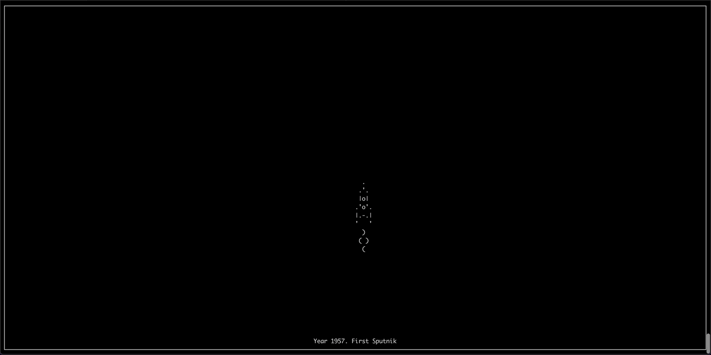

# Spaceship Game

Spaceship Game is a Python console-based game with curses library usage.

Game will be over if you have collision with flying garbage.

## Prerequisites

- Python 3.7+


## Installation

Use git to download the game.

```bash
$ git clone https://github.com/elzzz/spaceship-game.git
```

## Usage

To start the game you should write in console:

```bash
$ python main.py
```

## Controls
Movement - **↑ → ↓ ←**

Fire - **Space** _(Can be used only in 2020 year)_

Exit the game - **CTRL + C**

## Game Example
Game



Fire


## Contributing
Pull requests are welcome. For major changes, please open an issue first to discuss what you would like to change.

## License
[MIT](https://choosealicense.com/licenses/mit/)                 